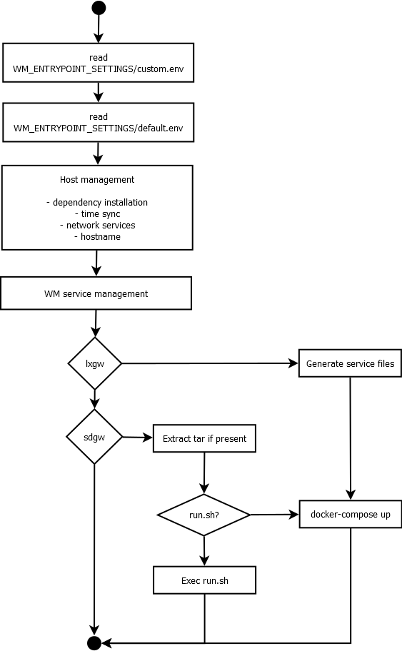

=========
wm-config
=========

The Wirepas Host Configurator (wm-config) is a shell utility that prepares the target host
for specific Wirepas software *(see bin/wm-config.sh)*.

The main goal of wm-config is to install the gateway software on a Raspberry pi (rpi) - running Raspbian.

.. attention::
    Please ensure that you are using linux line feeds when attempting to run
    wm-config. For more infomration please review:

    ::

        https://help.github.com/en/articles/dealing-with-line-endings

Installation
------------

To install the wm-config clone this repository directly on the raspberry pi and run

::

	./setup.sh

Alternatively you can generate an installation bundle (tar.gz) to distribute
over multiple hosts. To generate the bundle run

::

	./pack.sh

A tar.gz file will be created under ./deliverable/wm-config.tar.gz.
Copy the tar.gz file to the host's HOME directory and run

::

	./setup.sh

By default the script will create the WM_SERVICE_HOME target and extract
the tar contents inside it.

If there is a file in the host's home with **custom** in its
filename, the script will copy that file to the entrypoint path.

After the extraction the script will by default call wm-config.

If you do not wish to call wm-config, please pass false to the setup execution
with

::

    ./setup.sh false

Runtime operation
------------------

Upon startup, the wm-config will source the modules (see /modules) and
evaluate the default and custom environment files (on a rpi the entrypoint
for the custom settings is set to /boot/wirepas/custom.env).

The environment keys will define the wm-config's behaviour and execute the
necessary management of the host, including rebooting when necessary.

`Figure 1`_ provides an overview of the steps taken by wm-config.

.. _Figure 1:

   **Figure 1:** Overview of wm-config's operation flow.

To monitor the status of wm-config you can relie on systemctl and journalctl.
With systemctl type on the host's shell

::

    systemctl status wirepas-updater

which will show you the current status of the service.

With journalctl type on the host's shell

::

    journalctl -fu wirepas-updater

which will present you the latest status of the service and keep tracking
it (-f).

The name of the service is in fact the one specified in WM_CFG_SYSTEMD_UPDATER
which defaults to wirepas-updater.

Environment keys
----------------

The custom and default environment files can contain any of the following keys.
It is not recommended to change the default environment file as it will be
overwritten by updates.

Any environment customization should be done within the custom environment file,
which will reside in WM_ENTRYPOINT_SETTINGS. The default value is controled
by the `executable itself <./bin/wm-config.sh>`_.

.. _table_start:
==================================================  ================================================================================================================================
**Variable**                                            **Definition**
==================================================  ================================================================================================================================
*WM-CONFIG execution control*
------------------------------------------------------------------------------------------------------------------------------------------------------------------------------------
**WM_CFG_UPDATE**                                     When *true* the wm-config executable will be updated and the device will reboot (*default=true*)
**WM_CFG_PULL_SETTINGS**                              When *true* the wm-config will pull a settings image based on the WM_CFG_SETTINGS_IMAGE and WM_CFG_SETTINGS_VERSION (*default=false*)
**WM_CFG_REBOOT_DELAY**                               Sets the amount of seconds to wait before taking an action, such as a status report (*default=10*)
**WM_CFG_HOST_INSTALL_DEPENDENCIES**                  When *true* the wm-config will run (if present) /boot/wirepas/host_requiremens.sh and /boot/wirepas/requirements.txt (*default=true*)
**WM_CFG_HOST_UPGRADE**                               When *true* the wm-config will ensure all host packages are upgraded (*default=true*)
**WM_CFG_SETTINGS_IMAGE**                             The registry and name of the docker image containing the wm-config settings (*default=wirepas/gateway-settings-rpi*)
**WM_CFG_SETTINGS_VERSION**                           The image tag to pull (*default=latest*)
**WM_CFG_STARTUP_DELAY**                              An arbitary amount of seconds to wait for the host to receive an ip (*default=80*)
**WM_CFG_SYSTEMD_UPDATER_INTERVAL**                   The amount of seconds between each run of the SYSTEMD job (*default=86400*)
**WM_HOST_AVAHI_SERVICES**                            Where to source avahi services from (*default=/ssh.service*)
**WM_LXGW_DBUS_CONF_USER**                            The user to give access to the wirepas services over dbus (*default=root*)
*Systemd jobs that oversee wm-config*
------------------------------------------------------------------------------------------------------------------------------------------------------------------------------------
**WM_CFG_SYSTEMD_UPDATER**                            The name of the systemd job that monitors the wm-config state (*default=wirepas-updater*)
**WM_CFG_SYSTEMD_UPDATER_DISABLE**                    When *true* the systemd job will be disabled (*default=false*)
**WM_CFG_SYSTEMD_UPDATER_ENABLE**                     When *true* the systemd job will be enabled and started (*default=true*)
*Wirepas gateway software control*
------------------------------------------------------------------------------------------------------------------------------------------------------------------------------------
**WM_GATEWAY**                                        Which gateway software to use, lxgw or sdgw (eg, bundle installation or custom script execution) (*default=lxgw*)
**WM_GATEWAY_STATE**                                  The state of the wm-services (start/stop) (*default=start*)
**WM_GATEWAY_CLEANUP**                                Ensures that all running services are terminatting before starting the selected gateway services (*default=false*)
*AWS client control*
------------------------------------------------------------------------------------------------------------------------------------------------------------------------------------
**WM_AWS_ACCOUNT_ID**                                 AWS account id tied with the aws client
**WM_AWS_REGION**                                     AWS region to use with aws client (*default=*)
**WM_AWS_ACCESS_KEY_ID**                              AWS access key to use with aws client (*default=*)
**WM_AWS_SECRET_ACCESS_KEY**                          AWS secret access key to use with the aws client (*default=*)
*Docker daemon configuration*
------------------------------------------------------------------------------------------------------------------------------------------------------------------------------------
**WM_DOCKER_REGISTRY_LOGIN**                          When true, wm-config will authenticate the Docker daemon with a remote registry (support: AWS only) (*default=false*)
**WM_DOCKER_REGISTRY**                                The Docker registry from where to pull images (*default=wirepas*)
**WM_DOCKER_CLEANUP**                                 Forces a cleanup of all running docker containers and performs a system prune (*default=true*)
**WM_DOCKER_FORCE_RECREATE**                          Ensures that containers are recreated whenever the services are restored (*default=false*)
**WM_DOCKER_STATUS_DELAY**                            The amount of seconds to wait before printing the status of the docker containers (*default=30*)
**WM_DOCKER_CONFIGURE_DAEMON**                        When true, wm-config will attempt to configure the docker dameon with the JSON present in WM_DOCKER_DAEMON_JSON (*default=false*)
**WM_DOCKER_DAEMON_JSON**                             The JSON text to configure the docker daemon with (*default=*)
*Wirepas Linux Gateway*
------------------------------------------------------------------------------------------------------------------------------------------------------------------------------------
**WM_LXGW_IMAGE**                                     The name of the WM Gateway Docker image to pull (*default=wirepas/gateway-rpi*)
**WM_LXGW_VERSION**                                   The tag associated with the WM Gateway image (*default=latest*)
**WM_LXGW_DBUS_CONF**                                 The DBUS configuration file to be present in the host environment (*default=com.wirepas.sink.conf*)
**WM_LXGW_SINK_SERVICE_CMD**                          The sink command to use with the sink service (*default=sink*)
**WM_LXGW_TRANSPORT_SERVICE_CMD**                     The transport command to use with the transport service (*default=transport*)
*Custom Gateway*
------------------------------------------------------------------------------------------------------------------------------------------------------------------------------------
**WM_SDGW_TAR_PATH**                                  Path to a tar which will be extracted and brough up by docker compose if a run script is not present (*default=/wm-gateway.tar.gz*)
**WM_SDGW_SCRIPT_PATH**                               The path to a generic script to handle the start of a gateway service or any other host job (*default=/run.sh*)
*Wirepas sink settings*
------------------------------------------------------------------------------------------------------------------------------------------------------------------------------------
**WM_ENABLE_SERIAL_SYMLINKS**                         When true, the wm-config will ensure Wirepas complaint devices are known with a given alias (*default=true*)
**WM_SERIAL_NICKNAME**                                The serial alias to associate with a Wirepas complaint device attached to the host (*default=ttyWM*)
**WM_FORCE_UART_PORT**                                Force the designated port to be used with the sink service (*default=*)
**WM_SINK_ID**                                        The pseudo id of the sink served by the sink service (*default=0*)
**WM_SINK_UART_PORT**                                 The default sink port (*default=/dev/ttyWM*)
**WM_SINK_UART_BITRATE**                              The baudrate to use when communicating with the sink device (*default=125000*)
*MQTT broker*
------------------------------------------------------------------------------------------------------------------------------------------------------------------------------------
**WM_SERVICES_HOST**                                  A hostname where to push the gateway data, eg, MQTT broker hostname or ip (*default=host.extwirepas.com*)
**WM_SERVICES_MQTT_PORT**                             Defines the MQTT port to use (unsecure 1883, secure 8883) (*default=8883*)
**WM_SERVICES_MQTT_USER**                             The device's MQTT username (*default=mqttuser*)
**WM_SERVICES_MQTT_PASSWORD**                         The device's MQTT password (*default=uiaidujfk1897fyeu023849sdh?(*)
**WM_SERVICES_TLS_ENABLED**                           When true, a secure connection will be established (*default=True*)
**WM_SERVICES_ALLOW_UNSECURE**                        When ture, allows an unsecure connection to be established (*default=*)
**WM_SERVICES_CERTIFICATE_CHAIN**                     The path to the CA certificate (*default=/etc/extwirepas.pem*)
*Gateway metadata*
------------------------------------------------------------------------------------------------------------------------------------------------------------------------------------
**WM_SERVICES_GATEWAY_ID**                            The id used to identifying the gateway at the MQTT level (*default=pos-silva*)
**WM_SERVICES_GATEWAY_MODEL**                         Metadata about the gateway model (*default=*)
**WM_SERVICES_GATEWAY_VERSION**                       Metadata about the gateway version (*default=*)
**WM_SERVICES_GATEWAY_IGNORED_ENDPOINTS_FILTER**      List of endpoints that should not be published to the MQTT broker (*default=*)
**WM_SERVICES_GATEWAY_WHITENED_ENDPOINTS_FILTER**     List of endpoints whose payload should be zeroed out when published to the broker (*default=*)
*Wirepas support settings*
------------------------------------------------------------------------------------------------------------------------------------------------------------------------------------
**WM_SUPPORT_HOST_NAME**                              For Wirepas support (*default=host.extwirepas.com*)
**WM_SUPPORT_HOST_KEY**                               For Wirepas support (*default=/support.pem*)
**WM_SUPPORT_HOST_KEY_PATH**                          For Wirepas support (*default=/home/silva/.ssh/support.pem*)
**WM_SUPPORT_HOST_PORT**                              For Wirepas support (*default=*)
**WM_SUPPORT_HOST_USER**                              For Wirepas support (*default=${USER}*)
*Host settings*
------------------------------------------------------------------------------------------------------------------------------------------------------------------------------------
**WM_HOST_SET_HOSTNAME**                              Sets the hostname of the host (*default=wirepas-evk*)
**WM_HOST_SSH_ENABLE_NETWORK_LOGIN**                  Enables ssh login using plain text passwords (Raspi only) (*default=false*)
**WM_HOST_IPV6_DISABLE**                              Blacklists the IPv6 module and reboots the host (*default=false*)
**WM_HOST_SET_KEYBOARD**                              Sets the host's keyboard (*default=false*)
**WM_HOST_KEYBOARD_XKBMODEL**                         Defines the host's keyboard model (*default=pc105*)
**WM_HOST_KEYBOARD_XKBLAYOUT**                        Defines the host's keyboard layout (*default=gb*)
**WM_HOST_KEYBOARD_XKBVARIANT**                       Defines the host's keyboard variant (*default=*)
**WM_HOST_KEYBOARD_XKBOPTIONS**                       Defines the host's keyboard options (*default=*)
**WM_HOST_KEYBOARD_BACKSPACE**                        Defines the host's keyboard backspace (*default=guess*)
**WM_HOST_USER_NAME**                                 The username of the host's admin user (*default=pi*)
**WM_HOST_USER_PASSWORD**                             The password of the host's admin user (*default=raspberry*)
**WM_HOST_USER_PPKI**                                 The public key to authorize in the ssh authorized keys (*default=ssh-rsa*)
**WM_WIFI_DISABLE**                                   When true, configures the wifi client to connect ot the specified SSID (*default=true*)
**WM_WIFI_AP_SSID**                                   The WiFi SSID to connect to (*default=*)
**WM_WIFI_AP_PASSWORD**                               The WiFi's SSID password (*default=*)
**WM_RPI_EXPAND_FILESYSTEM**                          When true expands the raspi filesystem (*default=true*)
*Web services integration*
------------------------------------------------------------------------------------------------------------------------------------------------------------------------------------
**WM_SLACK_WEBHOOK**                                  A slack webhook where to post information about the wm-config execution (*default=*)
**WM_MSTEAMS_WEBHOOK**                                A microsoft teams webhook where to post information about the wm-config execution (*default=*)
==================================================  ================================================================================================================================

.. _table_end:

Contributing
------------

Please raise issues and send us your pull requests.

License
------------
Licensed under the Apache License, Version 2.0. See LICENSE for the full license text.

